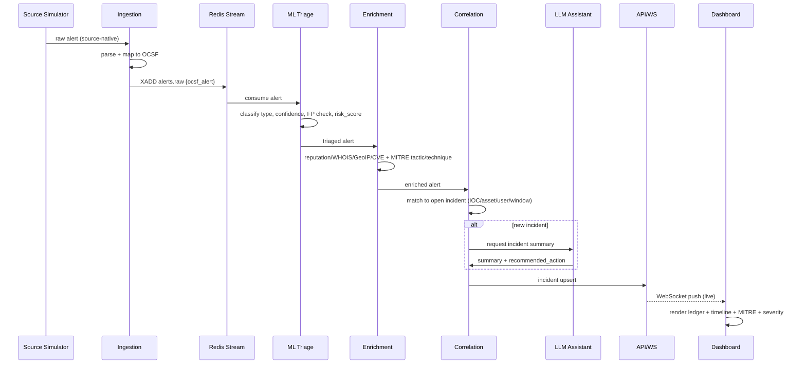

# FIFA AI-SIEM — Complete Implementation Guide

> **Code Cup 2026 · Problem Statement 8 — AI-Powered SOC for FIFA Digital Infrastructure**
> One definitive, end-to-end build document. Follow it top-to-bottom and you have a
> demo-ready AI-SIEM. Built by **reusing & adapting** the existing `cspm-ebpf`
> ("Sentinel-Core") stack that already lives in this repo.

---

## Table of Contents

1. [Executive Summary](#1-executive-summary)
2. [Architecture](#2-architecture)
3. [OCSF Alert Schema](#3-ocsf-alert-schema)
4. [Project Structure](#4-project-structure)
5. [Implementation — Layer by Layer](#5-implementation--layer-by-layer)
   - [5.1 Multi-Source Ingestion & Normalization](#51-multi-source-ingestion--normalization)
   - [5.2 Alert Simulator (11 sources)](#52-alert-simulator-11-sources)
   - [5.3 Correlation Engine](#53-correlation-engine)
   - [5.4 AI Triage & Dynamic Risk Scoring](#54-ai-triage--dynamic-risk-scoring)
   - [5.5 Threat-Intel Enrichment](#55-threat-intel-enrichment)
   - [5.6 LLM Security Assistant](#56-llm-security-assistant)
   - [5.7 API + WebSocket Backend](#57-api--websocket-backend)
   - [5.8 SOC Dashboard](#58-soc-dashboard)
6. [Phased Build Plan](#6-phased-build-plan)
7. [Deployment](#7-deployment)
8. [Demo Script (for judges)](#8-demo-script-for-judges)
9. [Verification](#9-verification)

---

## 1. Executive Summary

**FIFA AI-SIEM** is an AI-powered Security Operations Center platform. During a FIFA
tournament its digital ecosystem (ticketing, payments, media portals, mobile apps, admin
systems) throws thousands of alerts per hour. Analysts drown in noise. This platform:

- **Ingests** alerts from 11 simulated sources and **normalizes** them to a single **OCSF**-style schema.
- **Correlates** related alerts into a single **incident** (multi-stage attack chains).
- **Classifies** each alert by attack type (Phishing, Malware, Brute Force, Web Attack, Insider Threat, DDoS, …).
- **Triages** with ML: reduces false positives, assigns **dynamic risk scores** and incident priority.
- **Enriches** with threat intel: IP/domain reputation, WHOIS, GeoIP, CVE, **MITRE ATT&CK** mapping.
- **Assists** analysts with an **LLM** that writes investigation summaries, recommends remediation, and answers questions.
- **Visualizes** everything in a live **SOC dashboard**: incident timelines, attack trends, severity distribution, affected assets, MITRE matrix.

### Objective → Feature mapping (PS-8 rubric)

| PS-8 Core Objective | Where it's delivered |
|---|---|
| Ingest alerts from multiple simulated log sources | §5.1 ingestion + §5.2 simulator |
| Correlate related alerts into a single incident | §5.3 correlation engine |
| Classify alerts by attack type | §5.4 ML triage classifier |
| Prioritize by severity, confidence, business impact | §5.4 dynamic risk + priority |
| AI investigation summaries + recommended actions | §5.6 LLM assistant |
| Visualize timelines, systems, trends | §5.8 dashboard |
| Threat-intel enrichment (reputation, WHOIS, GeoIP, CVE, MITRE) | §5.5 enrichment |
| **Architecture diagrams (extra weightage)** | §2 (invest here for the demo) |

### Why reuse Sentinel-Core

The existing `cspm-ebpf` project already ships ~80% of the moving parts. We keep the plumbing,
swap the *input* from eBPF/Tetragon runtime events to multi-source SOC alerts, and re-theme
the dashboard around **incidents** instead of kernel syscalls.

| FIFA AI-SIEM need | Reuse from `cspm-ebpf` | Adaptation |
|---|---|---|
| Ingestion + normalization | `forwarder/transformer.py`, `forwarder/publisher.py` (Redis Streams) | 11 pluggable source parsers → OCSF |
| Common event schema | `forwarder/` unified JSON schema | Extend to OCSF fields from PDF sample |
| ML triage / FP reduction | `forwarder/ml_triage.py` + `forwarder/model/` (XGBoost) | Retrain on alert features via `scripts/train_model.py` |
| Correlation → incidents | *new* Redis stream consumer | IOC/asset/user + time-window + kill-chain |
| Threat-intel + MITRE RAG | `ingest.py`, `enterprise-attack.json` (45 MB MITRE) | Add reputation/WHOIS/GeoIP/CVE enrichers |
| LLM assistant | `orchestrator.py` (LangGraph + Gemini + Pinecone) | Investigation summaries + analyst Q&A |
| API + WebSocket | `dashboard_api.py` (FastAPI+WS), `forwarder/api.py` | Incidents/alerts/metrics endpoints |
| SOC dashboard | `dashboard/` (React 19 + Vite + Tailwind v4) | Rebrand components to incident views |
| Alert generator | `attacker-dashboard/` (Flask) | 11-source OCSF alert + scenario driver |
| Deploy | `docker-compose.yml`, `Dockerfile`, `Makefile` | Add simulator + correlation services |

---

## 2. Architecture

> **This section is judged with extra weightage.** Reproduce these two diagrams in your slide deck
> and the dashboard "About" panel.

### 2.1 Layered architecture

```mermaid
flowchart TB
    subgraph SRC["1 · Simulated FIFA Log Sources"]
        FW[Firewall]:::src
        WAF[WAF]:::src
        EDR[EDR]:::src
        AUTH[Auth / Identity]:::src
        DNS[DNS]:::src
        MAIL[Email Gateway]:::src
        SIEM[SIEM]:::src
        CLOUD[Cloud Security]:::src
        IDS[IDS / IPS]:::src
        TIX[Ticketing]:::src
        STREAM[Streaming]:::src
    end

    subgraph ING["2 · Ingestion & Normalization"]
        PARSE[Source Parsers]
        OCSF[OCSF Normalizer]
        PUB[Redis Stream Publisher]
    end

    BUS[("Redis Streams<br/>alerts.raw / incidents")]:::bus

    subgraph PIPE["3 · AI Processing Pipeline"]
        TRIAGE[ML Triage<br/>classify + FP filter + risk]
        ENRICH[Threat-Intel Enrichment<br/>reputation · WHOIS · GeoIP · CVE · MITRE]
        CORR[Correlation Engine<br/>IOC · asset · time · kill-chain]
        LLM[LLM Security Assistant<br/>summary · remediation · Q&A]
    end

    subgraph SERVE["4 · Serving"]
        API[FastAPI + WebSocket]
        STORE[(Incident Store<br/>Redis / SQLite)]
    end

    subgraph UI["5 · SOC Dashboard (React)"]
        LEDGER[Incident Ledger]
        TIMELINE[Attack Timeline]
        SEV[Severity + Trends]
        MITRE[MITRE Matrix]
        ASSETS[Affected Assets]
        CHAT[Analyst Chat]
    end

    SRC --> PARSE --> OCSF --> PUB --> BUS
    BUS --> TRIAGE --> ENRICH --> CORR --> LLM
    CORR --> STORE
    LLM --> STORE
    STORE --> API --> UI

    classDef src fill:#1e293b,stroke:#334155,color:#e2e8f0;
    classDef bus fill:#7c2d12,stroke:#c2410c,color:#fff;
```



### 2.2 Data flow (single alert → incident on screen)



### 2.3 Component responsibilities

| Component | Responsibility | Key tech |
|---|---|---|
| Source parsers | Turn 11 native formats into a common intermediate | Python |
| OCSF normalizer | Map to OCSF alert schema (§3) | Pydantic |
| Redis Streams | Durable, replayable event bus + consumer groups | Redis |
| ML triage | Attack-type classification, FP suppression, risk score | XGBoost, scikit-learn |
| Enrichment | External + local intel, MITRE ATT&CK tagging | httpx, GeoIP, MITRE JSON |
| Correlation | Group alerts → incidents, detect multi-stage chains | Python + Redis |
| LLM assistant | Summaries, remediation, analyst Q&A over RAG | LangGraph + Gemini + Pinecone/Chroma |
| API/WS | REST + live push to UI | FastAPI, Uvicorn |
| Dashboard | Analyst UX | React 19, Vite, Tailwind v4, Recharts |

---

## 3. OCSF Alert Schema

Derived directly from the PDF's sample alert. This is the **canonical internal format**; every
source parser must emit it. (OCSF = Open Cybersecurity Schema Framework; we use an OCSF-aligned
flat profile suited to the demo.)

### 3.1 Canonical alert (JSON)

```json
{
  "timestamp": "2026-07-15T19:45:33Z",
  "alert_id": "ALT-004582",
  "incident_id": "INC-000871",
  "event_source": "WAF",
  "event_type": "Phishing",
  "severity": "High",
  "confidence_score": 96,
  "risk_score": 93,
  "source_ip": "185.174.21.14",
  "destination_ip": "104.18.25.11",
  "domain": "fifa-ticket-secure2026.com",
  "url": "https://fifa-ticket-secure2026.com/login",
  "user": "anonymous",
  "device": "WEB-GW-01",
  "country": "Russia",
  "whois_age_days": 2,
  "ssl_valid": true,
  "visual_similarity_score": 98,
  "threat_intel_score": 91,
  "mitre_tactic": "Initial Access",
  "mitre_technique": "T1566.002",
  "ioc_type": "Domain",
  "ioc_value": "fifa-ticket-secure2026.com",
  "campaign_name": "Fake FIFA Ticket Campaign",
  "asset": "Official Ticket Portal",
  "description": "Recently registered domain impersonating the FIFA ticket portal with high visual similarity.",
  "recommended_action": "Block domain and investigate associated infrastructure."
}
```

### 3.2 Field reference

| Field | Type | Filled by | Notes |
|---|---|---|---|
| `timestamp` | ISO-8601 | source | event time (UTC `Z`) |
| `alert_id` | string | ingestion | `ALT-######` |
| `incident_id` | string | correlation | `INC-######`, null until grouped |
| `event_source` | enum | source | one of the 11 sources |
| `event_type` | enum | triage | Phishing, Malware, BruteForce, WebAttack, InsiderThreat, DDoS, CredentialTheft, Recon, DataExfil, Other |
| `severity` | enum | triage | Critical/High/Medium/Low/Info |
| `confidence_score` | int 0-100 | triage | model confidence |
| `risk_score` | int 0-100 | triage | dynamic (see §5.4) |
| `source_ip`/`destination_ip` | string | source | IOCs |
| `domain`/`url` | string | source | web IOCs |
| `user`/`device`/`asset` | string | source | affected identity/system |
| `country` | string | enrichment | GeoIP of source_ip |
| `whois_age_days` | int | enrichment | domain age |
| `ssl_valid` | bool | enrichment | cert validity |
| `visual_similarity_score` | int | enrichment | brand-impersonation detector |
| `threat_intel_score` | int | enrichment | reputation aggregate |
| `mitre_tactic`/`mitre_technique` | string | enrichment | ATT&CK mapping |
| `ioc_type`/`ioc_value` | string | enrichment | primary IOC for correlation |
| `campaign_name` | string | correlation | named cluster |
| `description` | string | triage/LLM | human summary |
| `recommended_action` | string | LLM | remediation |

### 3.3 Per-source native → OCSF mapping (examples)

| Source | Native fields → OCSF | Typical `event_type` |
|---|---|---|
| Firewall | `src`,`dst`,`action`,`proto`,`bytes` → source_ip/destination_ip | DDoS, Recon |
| WAF | `client_ip`,`uri`,`rule_id`,`payload` → source_ip/url | WebAttack, Phishing |
| EDR | `host`,`process`,`hash`,`parent` → device/asset | Malware, InsiderThreat |
| Auth/Identity | `user`,`result`,`geo`,`attempts` → user/country | BruteForce, CredentialTheft |
| DNS | `qname`,`qtype`,`resolver` → domain | Malware (C2), DataExfil |
| Email GW | `sender`,`subject`,`urls`,`spf` → domain/url | Phishing |
| SIEM | already normalized rule hit | Any |
| Cloud | `principal`,`action`,`resource` → user/asset | InsiderThreat, CredentialTheft |
| IDS/IPS | `sig_id`,`src`,`dst` → source_ip | Recon, WebAttack |
| Ticketing | `account`,`action`,`ip` → user/asset | Fraud/InsiderThreat |
| Streaming | `account`,`geo`,`concurrency` → user | AccountAbuse/DDoS |

---

## 4. Project Structure

New top-level folder in the repo, reusing modules from `cspm-ebpf/`:

```
fifa-ai-siem/
├── docker-compose.yml            # redis, simulator, ingest, pipeline, api, dashboard
├── Makefile                      # make up / seed / demo / down
├── .env.example                  # GEMINI_API_KEY, PINECONE_API_KEY, REDIS_URL ...
├── README.md
│
├── schema/
│   └── ocsf.py                   # Pydantic OCSF model (from §3)
│
├── ingestion/
│   ├── parsers/                  # one parser per source
│   │   ├── firewall.py  waf.py  edr.py  auth.py  dns.py
│   │   ├── email_gw.py  siem.py  cloud.py  ids.py  ticketing.py  streaming.py
│   │   └── base.py               # BaseParser -> OCSF
│   ├── normalizer.py             # dispatch native -> OCSF   (adapts forwarder/transformer.py)
│   └── publisher.py              # Redis XADD               (reuse forwarder/publisher.py)
│
├── simulator/
│   ├── generator.py              # emits realistic OCSF alerts across 11 sources
│   └── scenarios.py              # scripted multi-stage attack chains (demo)
│
├── pipeline/
│   ├── triage.py                 # XGBoost classify + FP + risk   (adapts forwarder/ml_triage.py)
│   ├── enrichment.py             # reputation/WHOIS/GeoIP/CVE/MITRE
│   ├── correlation.py            # alerts -> incidents
│   ├── llm_assistant.py          # LangGraph + Gemini            (adapts orchestrator.py)
│   └── worker.py                 # Redis consumer group runner
│
├── api/
│   └── server.py                 # FastAPI + WebSocket           (adapts dashboard_api.py)
│
├── store/
│   └── incidents.py              # incident persistence (Redis + SQLite)
│
├── ml/
│   ├── train_model.py            # trains alert classifier       (adapts scripts/train_model.py)
│   └── model/                    # xgboost_model.json, feature_list.json
│
├── intel/
│   └── mitre.py                  # loads enterprise-attack.json, technique lookup
│
└── dashboard/                    # React 19 (copy/rebrand cspm-ebpf/dashboard)
    └── src/
        ├── App.jsx  store.js
        └── components/
            ├── IncidentLedger.jsx   AttackTimeline.jsx   SeverityDonut.jsx
            ├── MitreMatrix.jsx      AssetMap.jsx         AttackTrends.jsx
            ├── IncidentDetail.jsx   AnalystChat.jsx      MetricsRow.jsx
```

---

## 5. Implementation — Layer by Layer

Copy-paste-ready code for each critical module. Paths are relative to `fifa-ai-siem/`.

### 5.0 Shared schema — `schema/ocsf.py`

```python
from __future__ import annotations
from datetime import datetime, timezone
from typing import Optional
from pydantic import BaseModel, Field

ATTACK_TYPES = ["Phishing", "Malware", "BruteForce", "WebAttack", "InsiderThreat",
                "DDoS", "CredentialTheft", "Recon", "DataExfil", "Other"]
SEVERITIES = ["Critical", "High", "Medium", "Low", "Info"]
SOURCES = ["Firewall", "WAF", "EDR", "Auth", "DNS", "Email", "SIEM",
           "Cloud", "IDS", "Ticketing", "Streaming"]

def _now() -> str:
    return datetime.now(timezone.utc).strftime("%Y-%m-%dT%H:%M:%SZ")

class OCSFAlert(BaseModel):
    timestamp: str = Field(default_factory=_now)
    alert_id: str
    incident_id: Optional[str] = None
    event_source: str
    event_type: str = "Other"
    severity: str = "Info"
    confidence_score: int = 0
    risk_score: int = 0
    source_ip: Optional[str] = None
    destination_ip: Optional[str] = None
    domain: Optional[str] = None
    url: Optional[str] = None
    user: Optional[str] = None
    device: Optional[str] = None
    country: Optional[str] = None
    whois_age_days: Optional[int] = None
    ssl_valid: Optional[bool] = None
    visual_similarity_score: Optional[int] = None
    threat_intel_score: Optional[int] = None
    mitre_tactic: Optional[str] = None
    mitre_technique: Optional[str] = None
    ioc_type: Optional[str] = None
    ioc_value: Optional[str] = None
    campaign_name: Optional[str] = None
    asset: Optional[str] = None
    description: Optional[str] = None
    recommended_action: Optional[str] = None
```

### 5.1 Multi-Source Ingestion & Normalization

`ingestion/parsers/base.py`

```python
from abc import ABC, abstractmethod
from itertools import count
from schema.ocsf import OCSFAlert

_seq = count(1)

def next_alert_id() -> str:
    return f"ALT-{next(_seq):06d}"

class BaseParser(ABC):
    source: str  # set by subclass

    @abstractmethod
    def to_ocsf(self, raw: dict) -> OCSFAlert:
        """Map a source-native record to the canonical OCSF alert."""
```

`ingestion/parsers/waf.py` (representative — write one per source)

```python
from ingestion.parsers.base import BaseParser, next_alert_id
from schema.ocsf import OCSFAlert

class WAFParser(BaseParser):
    source = "WAF"

    def to_ocsf(self, raw: dict) -> OCSFAlert:
        return OCSFAlert(
            alert_id=next_alert_id(),
            timestamp=raw.get("ts"),
            event_source=self.source,
            source_ip=raw.get("client_ip"),
            destination_ip=raw.get("server_ip"),
            url=raw.get("uri"),
            domain=raw.get("host"),
            user=raw.get("user", "anonymous"),
            device=raw.get("gateway", "WEB-GW-01"),
            asset=raw.get("asset", "Official Ticket Portal"),
            description=raw.get("rule_msg"),
        )
```

`ingestion/normalizer.py`

```python
from ingestion.parsers import (firewall, waf, edr, auth, dns, email_gw,
                               siem, cloud, ids, ticketing, streaming)

_REGISTRY = {
    "Firewall": firewall.FirewallParser(), "WAF": waf.WAFParser(),
    "EDR": edr.EDRParser(), "Auth": auth.AuthParser(), "DNS": dns.DNSParser(),
    "Email": email_gw.EmailParser(), "SIEM": siem.SIEMParser(),
    "Cloud": cloud.CloudParser(), "IDS": ids.IDSParser(),
    "Ticketing": ticketing.TicketingParser(), "Streaming": streaming.StreamingParser(),
}

def normalize(source: str, raw: dict):
    parser = _REGISTRY[source]
    return parser.to_ocsf(raw)
```

`ingestion/publisher.py` (reuse `forwarder/publisher.py` pattern)

```python
import json, os, redis
r = redis.from_url(os.getenv("REDIS_URL", "redis://localhost:6379"))
STREAM = "alerts.raw"

def publish(alert) -> str:
    return r.xadd(STREAM, {"data": alert.model_dump_json()}).decode()
```

### 5.2 Alert Simulator (11 sources)

`simulator/generator.py`

```python
import random, time
from datetime import datetime, timezone
from ingestion.normalizer import normalize
from ingestion.publisher import publish

FIFA_ASSETS = ["Official Ticket Portal", "Payment Gateway", "Media Portal",
               "Mobile App API", "Admin Console", "Streaming Platform"]
BAD_IPS = ["185.174.21.14", "45.155.205.99", "193.169.255.10"]
GOOD_IPS = ["104.18.25.11", "20.190.128.5", "142.250.196.14"]

def _ts():  # avoid module-load-time randomness; called at emit time
    return datetime.now(timezone.utc).strftime("%Y-%m-%dT%H:%M:%SZ")

def waf_event():
    return "WAF", {
        "ts": _ts(),
        "client_ip": random.choice(BAD_IPS + GOOD_IPS),
        "server_ip": random.choice(GOOD_IPS),
        "host": random.choice(["fifa-ticket-secure2026.com", "fifa.com"]),
        "uri": random.choice(["/login", "/../../etc/passwd", "/?q=1' OR '1'='1"]),
        "user": "anonymous",
        "asset": random.choice(FIFA_ASSETS),
        "rule_msg": "SQLi / suspicious login pattern",
    }

def auth_event():
    return "Auth", {
        "ts": _ts(),
        "client_ip": random.choice(BAD_IPS),
        "user": random.choice(["admin", "ticket_ops", "j.smith"]),
        "result": random.choice(["fail", "fail", "success"]),
        "attempts": random.randint(1, 60),
        "asset": "Admin Console",
    }

# ... firewall_event(), edr_event(), dns_event(), email_event(), etc.

EMITTERS = [waf_event, auth_event]  # extend to all 11

def run(rate_per_sec: float = 2.0):
    while True:
        src, raw = random.choice(EMITTERS)()
        publish(normalize(src, raw))
        time.sleep(1.0 / rate_per_sec)

if __name__ == "__main__":
    run()
```

`simulator/scenarios.py` — scripted multi-stage chain for the demo (recon → brute force →
phishing → malware → exfil). Emitting these in order lets the correlation engine build one
incident live on stage:

```python
import time
from ingestion.normalizer import normalize
from ingestion.publisher import publish

def fake_ticket_campaign():
    """Multi-stage 'Fake FIFA Ticket Campaign' — correlates into 1 incident."""
    steps = [
        ("DNS", {"ts": None, "qname": "fifa-ticket-secure2026.com", "src": "10.0.0.5"}),
        ("Email", {"ts": None, "sender": "tickets@fifa-ticket-secure2026.com",
                   "host": "fifa-ticket-secure2026.com", "uri": "/login"}),
        ("WAF", {"ts": None, "client_ip": "185.174.21.14",
                 "host": "fifa-ticket-secure2026.com", "uri": "/login"}),
        ("Auth", {"ts": None, "client_ip": "185.174.21.14", "user": "ticket_ops",
                  "result": "success", "attempts": 41}),
    ]
    for src, raw in steps:
        publish(normalize(src, raw))
        time.sleep(1.5)

if __name__ == "__main__":
    fake_ticket_campaign()
```

### 5.3 Correlation Engine

Groups enriched alerts into incidents. Rules (any match within the window links alerts):
shared **IOC value**, shared **asset**, shared **user**, or matching **kill-chain progression**.

`pipeline/correlation.py`

```python
import os, json, time, redis
from itertools import count
from schema.ocsf import OCSFAlert

r = redis.from_url(os.getenv("REDIS_URL", "redis://localhost:6379"))
WINDOW_SEC = 900            # 15-minute correlation window
_inc_seq = count(1)

def _incident_key(inc_id): return f"incident:{inc_id}"

def _find_open_incident(alert: OCSFAlert):
    """Return incident_id if an open incident shares an IOC/asset/user in-window."""
    for key in r.scan_iter("incident:*"):
        inc = json.loads(r.get(key))
        if time.time() - inc["last_seen"] > WINDOW_SEC:
            continue
        keys_a = {alert.ioc_value, alert.asset, alert.user, alert.source_ip}
        keys_i = set(inc["ioc_values"]) | {inc["asset"]} | set(inc["users"])
        if keys_a & keys_i:
            return inc["incident_id"]
    return None

def correlate(alert: OCSFAlert) -> str:
    inc_id = _find_open_incident(alert)
    if inc_id is None:
        inc_id = f"INC-{next(_inc_seq):06d}"
        inc = {
            "incident_id": inc_id, "created": time.time(), "last_seen": time.time(),
            "asset": alert.asset, "users": [], "ioc_values": [], "alert_ids": [],
            "max_risk": 0, "tactics": [], "campaign_name": alert.campaign_name,
        }
    else:
        inc = json.loads(r.get(_incident_key(inc_id)))

    inc["last_seen"] = time.time()
    inc["alert_ids"].append(alert.alert_id)
    inc["max_risk"] = max(inc["max_risk"], alert.risk_score)
    for lst, val in [("users", alert.user), ("ioc_values", alert.ioc_value),
                     ("tactics", alert.mitre_tactic)]:
        if val and val not in inc[lst]:
            inc[lst].append(val)
    inc["priority"] = _priority(inc["max_risk"], len(inc["tactics"]))
    r.set(_incident_key(inc_id), json.dumps(inc))
    alert.incident_id = inc_id
    return inc_id

def _priority(max_risk: int, n_tactics: int) -> str:
    # multi-stage (more distinct tactics) escalates priority
    score = max_risk + n_tactics * 8
    return ("P1" if score >= 90 else "P2" if score >= 70
            else "P3" if score >= 40 else "P4")
```

> **Multi-stage detection:** an incident touching multiple distinct `mitre_tactic` values
> (e.g. Initial Access → Credential Access → Exfiltration) is a **kill-chain**; the priority
> formula boosts it, and the LLM (§5.6) narrates the chain.

### 5.4 AI Triage & Dynamic Risk Scoring

Adapts `forwarder/ml_triage.py`. XGBoost multi-class classifier for `event_type`, plus a
false-positive gate and a dynamic risk score.

`ml/train_model.py` (feature engineering + train — adapts `scripts/train_model.py`)

```python
import json, numpy as np, pandas as pd, xgboost as xgb
from sklearn.model_selection import train_test_split
from schema.ocsf import ATTACK_TYPES

FEATURES = ["confidence_score", "whois_age_days", "visual_similarity_score",
            "threat_intel_score", "src_is_known_bad", "failed_attempts",
            "off_hours", "is_external", "url_entropy"]

def train(csv_path="data/labeled_alerts.csv", out_dir="ml/model"):
    df = pd.read_csv(csv_path).fillna(0)
    X, y = df[FEATURES], df["label"].map({t: i for i, t in enumerate(ATTACK_TYPES)})
    Xtr, Xte, ytr, yte = train_test_split(X, y, test_size=0.2, random_state=42)
    clf = xgb.XGBClassifier(n_estimators=300, max_depth=6, learning_rate=0.1,
                            objective="multi:softprob", num_class=len(ATTACK_TYPES))
    clf.fit(Xtr, ytr)
    print("val accuracy:", clf.score(Xte, yte))
    clf.save_model(f"{out_dir}/xgboost_model.json")
    json.dump(FEATURES, open(f"{out_dir}/feature_list.json", "w"))

if __name__ == "__main__":
    train()
```

`pipeline/triage.py`

```python
import json, math, xgboost as xgb
from schema.ocsf import OCSFAlert, ATTACK_TYPES

_model = xgb.XGBClassifier()
_model.load_model("ml/model/xgboost_model.json")
_FEATURES = json.load(open("ml/model/feature_list.json"))
KNOWN_BAD = {"185.174.21.14", "45.155.205.99", "193.169.255.10"}

def _featurize(a: OCSFAlert) -> list:
    url = a.url or ""
    def entropy(s):
        if not s: return 0.0
        p = [s.count(c) / len(s) for c in set(s)]
        return round(-sum(x * math.log2(x) for x in p), 2)
    feats = {
        "confidence_score": a.confidence_score or 0,
        "whois_age_days": a.whois_age_days or 999,
        "visual_similarity_score": a.visual_similarity_score or 0,
        "threat_intel_score": a.threat_intel_score or 0,
        "src_is_known_bad": int((a.source_ip or "") in KNOWN_BAD),
        "failed_attempts": 0,
        "off_hours": 0,
        "is_external": int(bool(a.source_ip) and not (a.source_ip or "").startswith("10.")),
        "url_entropy": entropy(url),
    }
    return [feats[f] for f in _FEATURES]

def triage(a: OCSFAlert) -> OCSFAlert:
    import numpy as np
    proba = _model.predict_proba(np.array([_featurize(a)]))[0]
    idx = int(proba.argmax())
    a.event_type = ATTACK_TYPES[idx]
    a.confidence_score = a.confidence_score or int(proba[idx] * 100)

    # False-positive gate: low confidence + no known-bad IOC => downgrade
    is_fp = a.confidence_score < 40 and (a.source_ip or "") not in KNOWN_BAD
    a.risk_score = _risk(a, is_fp)
    a.severity = _severity(a.risk_score)
    if is_fp:
        a.event_type = "Other"
    return a

def _risk(a: OCSFAlert, is_fp: bool) -> int:
    if is_fp:
        return max(0, (a.confidence_score or 0) // 3)
    business = {"Payment Gateway": 30, "Official Ticket Portal": 25,
                "Admin Console": 25}.get(a.asset or "", 10)
    intel = (a.threat_intel_score or 0) * 0.4
    conf = (a.confidence_score or 0) * 0.3
    known_bad = 20 if (a.source_ip or "") in KNOWN_BAD else 0
    return min(100, int(business + intel + conf * 0.3 + known_bad))

def _severity(risk: int) -> str:
    return ("Critical" if risk >= 90 else "High" if risk >= 70
            else "Medium" if risk >= 40 else "Low" if risk >= 15 else "Info")
```

> **Risk formula (documented for judges):**
> `risk = business_impact(asset) + 0.4·threat_intel + 0.3·confidence + known_bad_bonus`, clamped 0-100.
> FP-gated alerts are downgraded so analysts see less noise — directly addressing "reduce alert fatigue".

### 5.5 Threat-Intel Enrichment

`pipeline/enrichment.py` — reputation, WHOIS age, GeoIP, CVE, MITRE mapping. External calls are
optional (offline fallbacks keep the demo deterministic).

```python
import os, httpx
from schema.ocsf import OCSFAlert
from intel.mitre import map_to_attack

KNOWN_BAD = {"185.174.21.14": ("Russia", 95), "45.155.205.99": ("Netherlands", 88)}

def _geo_and_rep(ip: str):
    if ip in KNOWN_BAD:
        return KNOWN_BAD[ip]
    # optional live lookup; guarded so demo runs offline
    if os.getenv("ENABLE_LIVE_INTEL") == "1" and ip:
        try:
            g = httpx.get(f"https://ipapi.co/{ip}/json/", timeout=3).json()
            return g.get("country_name", "Unknown"), 20
        except Exception:
            pass
    return "Unknown", 10

def enrich(a: OCSFAlert) -> OCSFAlert:
    if a.source_ip:
        a.country, rep = _geo_and_rep(a.source_ip)
        a.threat_intel_score = max(a.threat_intel_score or 0, rep)
    if a.domain and a.whois_age_days is None:
        a.whois_age_days = 2 if "secure2026" in a.domain else 400   # stub / live via python-whois
    # primary IOC selection for correlation
    if not a.ioc_value:
        a.ioc_type, a.ioc_value = (
            ("Domain", a.domain) if a.domain else
            ("URL", a.url) if a.url else
            ("IP", a.source_ip) if a.source_ip else ("User", a.user))
    # MITRE ATT&CK mapping from event_type
    a.mitre_tactic, a.mitre_technique = map_to_attack(a.event_type)
    return a
```

`intel/mitre.py` — loads the existing `enterprise-attack.json` (already in the repo) for a real
technique catalogue; falls back to a static map.

```python
import json, os

_STATIC = {
    "Phishing": ("Initial Access", "T1566"),
    "BruteForce": ("Credential Access", "T1110"),
    "CredentialTheft": ("Credential Access", "T1555"),
    "Malware": ("Execution", "T1204"),
    "WebAttack": ("Initial Access", "T1190"),
    "InsiderThreat": ("Exfiltration", "T1052"),
    "DataExfil": ("Exfiltration", "T1041"),
    "DDoS": ("Impact", "T1498"),
    "Recon": ("Reconnaissance", "T1595"),
    "Other": (None, None),
}

def map_to_attack(event_type: str):
    return _STATIC.get(event_type, (None, None))

def load_catalogue(path="../cspm-ebpf/enterprise-attack.json"):
    """Optional: index the full MITRE STIX bundle for richer lookups / RAG."""
    if not os.path.exists(path):
        return {}
    bundle = json.load(open(path, encoding="utf-8"))
    out = {}
    for obj in bundle.get("objects", []):
        if obj.get("type") == "attack-pattern":
            for ref in obj.get("external_references", []):
                if ref.get("source_name") == "mitre-attack":
                    out[ref["external_id"]] = obj.get("name")
    return out
```

### 5.6 LLM Security Assistant

Adapts `orchestrator.py` (LangGraph + Gemini + Pinecone/Chroma RAG over MITRE). Produces the
investigation summary + recommended action per incident and answers analyst questions.

`pipeline/llm_assistant.py`

```python
import os, json, redis
from langchain_google_genai import ChatGoogleGenerativeAI

r = redis.from_url(os.getenv("REDIS_URL", "redis://localhost:6379"))
_llm = ChatGoogleGenerativeAI(model="gemini-2.5-pro",
                              google_api_key=os.getenv("GEMINI_API_KEY"),
                              temperature=0.2)

SUMMARY_PROMPT = """You are a FIFA SOC Tier-3 analyst. Summarize this security incident for
a Tier-1 analyst. Be concise and factual.

Incident {incident_id} (priority {priority}, max risk {max_risk}).
Distinct MITRE tactics observed: {tactics}
Alerts:
{alerts_json}

Return JSON with keys: summary, attack_narrative, recommended_action, confidence."""

def summarize_incident(inc_id: str) -> dict:
    inc = json.loads(r.get(f"incident:{inc_id}"))
    alerts = [json.loads(r.get(f"alert:{aid}")) for aid in inc["alert_ids"]
              if r.exists(f"alert:{aid}")]
    prompt = SUMMARY_PROMPT.format(
        incident_id=inc_id, priority=inc.get("priority"), max_risk=inc["max_risk"],
        tactics=inc.get("tactics"), alerts_json=json.dumps(alerts, indent=2)[:6000])
    resp = _llm.invoke(prompt).content
    try:
        result = json.loads(resp[resp.find("{"): resp.rfind("}") + 1])
    except Exception:
        result = {"summary": resp, "recommended_action": "Review manually.",
                  "attack_narrative": "", "confidence": 60}
    inc.update(result)
    r.set(f"incident:{inc_id}", json.dumps(inc))
    return result

def answer_query(incident_id: str, question: str) -> str:
    inc = json.loads(r.get(f"incident:{incident_id}"))
    prompt = (f"Incident context:\n{json.dumps(inc)[:6000]}\n\n"
              f"Analyst question: {question}\nAnswer concisely.")
    return _llm.invoke(prompt).content
```

> **RAG note:** For grounded remediation, reuse `ingest.py` to index `enterprise-attack.json` +
> CIS benchmark into Pinecone (or ChromaDB offline). Retrieve top-k technique docs by
> `mitre_technique` and prepend to `SUMMARY_PROMPT`.

`pipeline/worker.py` — the consumer that runs the whole pipeline per alert.

```python
import os, json, redis
from schema.ocsf import OCSFAlert
from pipeline.triage import triage
from pipeline.enrichment import enrich
from pipeline.correlation import correlate
from pipeline.llm_assistant import summarize_incident

r = redis.from_url(os.getenv("REDIS_URL", "redis://localhost:6379"))
GROUP, CONSUMER, STREAM = "soc", "worker-1", "alerts.raw"

def _ensure_group():
    try: r.xgroup_create(STREAM, GROUP, id="0", mkstream=True)
    except redis.ResponseError: pass

def run():
    _ensure_group()
    while True:
        msgs = r.xreadgroup(GROUP, CONSUMER, {STREAM: ">"}, count=10, block=5000)
        for _stream, entries in msgs or []:
            for msg_id, fields in entries:
                a = OCSFAlert(**json.loads(fields[b"data"]))
                a = triage(a)
                a = enrich(a)
                r.set(f"alert:{a.alert_id}", a.model_dump_json())
                inc_id = correlate(a)
                r.set(f"alert:{a.alert_id}", a.model_dump_json())   # now carries incident_id
                if os.getenv("GEMINI_API_KEY"):
                    summarize_incident(inc_id)
                r.publish("incidents.live", inc_id)                 # notify API/WS
                r.xack(STREAM, GROUP, msg_id)

if __name__ == "__main__":
    run()
```

### 5.7 API + WebSocket Backend

Adapts `dashboard_api.py`. Serves incidents/alerts/metrics and pushes live updates.

`api/server.py`

```python
import os, json, asyncio, redis.asyncio as aioredis
from fastapi import FastAPI, WebSocket
from fastapi.middleware.cors import CORSMiddleware

app = FastAPI(title="FIFA AI-SIEM API")
app.add_middleware(CORSMiddleware, allow_origins=["*"], allow_methods=["*"], allow_headers=["*"])
R = aioredis.from_url(os.getenv("REDIS_URL", "redis://localhost:6379"))

@app.get("/api/incidents")
async def incidents():
    out = []
    async for key in R.scan_iter("incident:*"):
        out.append(json.loads(await R.get(key)))
    return sorted(out, key=lambda i: i["last_seen"], reverse=True)

@app.get("/api/incidents/{inc_id}")
async def incident(inc_id: str):
    raw = await R.get(f"incident:{inc_id}")
    inc = json.loads(raw)
    inc["alerts"] = [json.loads(await R.get(f"alert:{a}"))
                     for a in inc["alert_ids"] if await R.exists(f"alert:{a}")]
    return inc

@app.get("/api/metrics")
async def metrics():
    incs, sev, types = [], {}, {}
    async for key in R.scan_iter("incident:*"):
        incs.append(json.loads(await R.get(key)))
    async for key in R.scan_iter("alert:*"):
        a = json.loads(await R.get(key))
        sev[a["severity"]] = sev.get(a["severity"], 0) + 1
        types[a["event_type"]] = types.get(a["event_type"], 0) + 1
    return {"open_incidents": len(incs), "by_severity": sev, "by_type": types,
            "p1": sum(1 for i in incs if i.get("priority") == "P1")}

@app.post("/api/incidents/{inc_id}/ask")
async def ask(inc_id: str, body: dict):
    from pipeline.llm_assistant import answer_query
    return {"answer": answer_query(inc_id, body.get("question", ""))}

@app.websocket("/api/ws/incidents")
async def ws(sock: WebSocket):
    await sock.accept()
    pub = R.pubsub(); await pub.subscribe("incidents.live")
    async for m in pub.listen():
        if m["type"] == "message":
            inc_id = m["data"].decode()
            await sock.send_text(await R.get(f"incident:{inc_id}"))
```

### 5.8 SOC Dashboard

Copy `cspm-ebpf/dashboard/` → `fifa-ai-siem/dashboard/` and rebrand. The store connects to the
WS feed (mirrors the existing `dashboard/src/store.js` + `App.jsx` pattern).

`dashboard/src/store.js` (Zustand)

```javascript
import { create } from "zustand";

const API = import.meta.env.VITE_API || "http://localhost:8080";

export const useSoc = create((set, get) => ({
  incidents: [], metrics: {}, selected: null,

  async load() {
    const [i, m] = await Promise.all([
      fetch(`${API}/api/incidents`).then(r => r.json()),
      fetch(`${API}/api/metrics`).then(r => r.json()),
    ]);
    set({ incidents: i, metrics: m });
  },

  connect() {
    const ws = new WebSocket(`${API.replace("http", "ws")}/api/ws/incidents`);
    ws.onmessage = (e) => {
      const inc = JSON.parse(e.data);
      const rest = get().incidents.filter(x => x.incident_id !== inc.incident_id);
      set({ incidents: [inc, ...rest] });
    };
  },

  select(id) { set({ selected: id }); },
}));
```

`dashboard/src/components/IncidentLedger.jsx` (adapts existing `IncidentLedger.jsx`)

```jsx
import { useSoc } from "../store";

const PRIO = { P1: "bg-red-600", P2: "bg-orange-500", P3: "bg-yellow-500", P4: "bg-slate-500" };

export default function IncidentLedger() {
  const { incidents, select } = useSoc();
  return (
    <div className="rounded-xl bg-slate-900 p-4">
      <h2 className="mb-3 text-lg font-semibold text-slate-100">Incidents</h2>
      <table className="w-full text-sm text-slate-300">
        <thead className="text-slate-400">
          <tr><th className="text-left">ID</th><th>Priority</th><th>Risk</th>
              <th>Asset</th><th>Tactics</th><th>Alerts</th></tr>
        </thead>
        <tbody>
          {incidents.map((i) => (
            <tr key={i.incident_id} onClick={() => select(i.incident_id)}
                className="cursor-pointer border-t border-slate-800 hover:bg-slate-800">
              <td className="py-2 font-mono">{i.incident_id}</td>
              <td><span className={`rounded px-2 py-0.5 text-white ${PRIO[i.priority]}`}>{i.priority}</span></td>
              <td className="text-center">{i.max_risk}</td>
              <td>{i.asset}</td>
              <td className="text-center">{i.tactics?.length || 0}</td>
              <td className="text-center">{i.alert_ids?.length || 0}</td>
            </tr>
          ))}
        </tbody>
      </table>
    </div>
  );
}
```

Other components (charts use **Recharts**, already compatible with the React 19 dashboard):

- **AttackTimeline.jsx** — horizontal timeline of alerts within the selected incident (shows the kill-chain order).
- **SeverityDonut.jsx** — `metrics.by_severity` donut.
- **AttackTrends.jsx** — alerts/hour line chart by `event_type`.
- **MitreMatrix.jsx** — grid of tactics × techniques; cells light up per incident.
- **AssetMap.jsx** — FIFA assets with alert counts (Ticket Portal, Payment GW, …).
- **IncidentDetail.jsx** — LLM `summary`, `attack_narrative`, `recommended_action`, alert list.
- **AnalystChat.jsx** — posts to `/api/incidents/{id}/ask`, renders the LLM answer.

---

## 6. Phased Build Plan

Milestone checklist (compresses to ~2-3 focused days for a hackathon team of 3-4).

**Phase 0 — Scaffold (½ day)**
- [ ] Create `fifa-ai-siem/` tree (§4), `.env.example`, `docker-compose.yml`, `Makefile`.
- [ ] `schema/ocsf.py` + Redis up. Publish one hard-coded OCSF alert and read it back.

**Phase 1 — Ingestion + Simulator (½ day)**
- [ ] `ingestion/parsers/*` for all 11 sources + `normalizer.py` + `publisher.py`.
- [ ] `simulator/generator.py` streaming to `alerts.raw`. Verify with `redis-cli XLEN alerts.raw`.

**Phase 2 — Pipeline core (1 day)**
- [ ] `ml/train_model.py` on synthetic labeled data → `ml/model/`.
- [ ] `pipeline/triage.py`, `enrichment.py`, `correlation.py`, `worker.py`.
- [ ] Confirm alerts become incidents: `redis-cli KEYS 'incident:*'`.

**Phase 3 — LLM + API (½ day)**
- [ ] `pipeline/llm_assistant.py` (Gemini) wired into `worker.py`.
- [ ] `api/server.py` REST + WS. Hit `/api/incidents`, `/api/metrics`.

**Phase 4 — Dashboard (½ day)**
- [ ] Copy/rebrand `dashboard/`; wire `store.js` to API + WS.
- [ ] IncidentLedger, Timeline, SeverityDonut, MitreMatrix, IncidentDetail, AnalystChat.

**Phase 5 — Demo polish (½ day)**
- [ ] `simulator/scenarios.py` scripted kill-chain.
- [ ] Architecture diagrams in deck + dashboard "About".
- [ ] Rehearse the §8 demo script.

---

## 7. Deployment

### 7.1 `.env.example`

```bash
REDIS_URL=redis://redis:6379
GEMINI_API_KEY=your_google_ai_studio_key      # optional; pipeline degrades gracefully
PINECONE_API_KEY=your_pinecone_key            # optional; ChromaDB fallback
ENABLE_LIVE_INTEL=0                           # 1 to enable live GeoIP/WHOIS
VITE_API=http://localhost:8080
```

### 7.2 `docker-compose.yml`

```yaml
services:
  redis:
    image: redis:7-alpine
    ports: ["6379:6379"]

  worker:
    build: .
    command: python -m pipeline.worker
    env_file: .env
    depends_on: [redis]

  simulator:
    build: .
    command: python -m simulator.generator
    env_file: .env
    depends_on: [redis]

  api:
    build: .
    command: uvicorn api.server:app --host 0.0.0.0 --port 8080
    env_file: .env
    ports: ["8080:8080"]
    depends_on: [redis]

  dashboard:
    build: ./dashboard
    ports: ["5173:5173"]
    environment: [VITE_API=http://localhost:8080]
    depends_on: [api]
```

### 7.3 `Makefile`

```makefile
up:        ## start redis + api + worker
	docker compose up -d redis worker api
seed:      ## start the continuous simulator
	docker compose up -d simulator
demo:      ## run the scripted kill-chain
	docker compose run --rm simulator python -m simulator.scenarios
dash:      ## start the dashboard
	docker compose up -d dashboard
down:
	docker compose down -v
train:
	python -m ml.train_model
```

### 7.4 Local run (no Docker)

```bash
python -m venv .venv && source .venv/Scripts/activate   # Windows: .venv\Scripts\activate
pip install -r requirements.txt                          # reuse cspm-ebpf deps + xgboost, redis, fastapi
redis-server &                                           # or docker run -p 6379:6379 redis:7-alpine
python -m ml.train_model
python -m pipeline.worker &
python -m simulator.generator &
uvicorn api.server:app --port 8080 &
cd dashboard && npm install && npm run dev
```

---

## 8. Demo Script (for judges)

1. **Open the dashboard** (`localhost:5173`) — empty ledger, live metrics at zero.
2. **Start the simulator** (`make seed`) — alerts stream in; ledger fills; severity donut and
   attack-trend chart animate. Talk to "reducing alert fatigue": show FP-downgraded alerts sink to Low.
3. **Run the scripted attack** (`make demo` — the *Fake FIFA Ticket Campaign*):
   DNS lookup → phishing email → WAF hit → successful brute-forced login.
4. **Watch correlation**: the four alerts collapse into **one P1 incident** on the Ticket Portal,
   with **multiple MITRE tactics** lighting up the matrix (Initial Access → Credential Access).
5. **Open the incident**: show the **LLM investigation summary**, **attack narrative** (kill-chain),
   and **recommended action** ("Block domain and investigate associated infrastructure").
6. **Ask the assistant** a question in AnalystChat ("What assets are affected and why is this P1?").
7. **Close on the architecture diagram** (§2) — emphasise OCSF normalization, the Redis-Streams
   backbone, and how each layer maps to the PS-8 objectives.

---

## 9. Verification

Confirm each layer end-to-end.

| Layer | Command / action | Expected |
|---|---|---|
| Redis + schema | `python -c "from ingestion.publisher import publish; from schema.ocsf import OCSFAlert; print(publish(OCSFAlert(alert_id='ALT-000001', event_source='WAF')))"` | prints a stream id |
| Ingestion | `redis-cli XLEN alerts.raw` after simulator | grows over time |
| Triage | inspect `redis-cli GET alert:ALT-000001` | has `event_type`, `risk_score`, `severity` |
| Enrichment | same alert | has `country`, `mitre_tactic`, `ioc_value` |
| Correlation | `redis-cli KEYS 'incident:*'` | ≥1 incident; scripted demo yields exactly one grouped incident |
| Kill-chain | that incident's `tactics` | length ≥ 2, `priority` = P1 |
| LLM | `redis-cli GET incident:INC-000001` | has `summary`, `recommended_action` (if `GEMINI_API_KEY` set) |
| API | `curl localhost:8080/api/incidents` / `/api/metrics` | JSON with incidents + severity/type counts |
| WebSocket | open dashboard while simulator runs | ledger updates live without refresh |
| ML training | `python -m ml.train_model` | prints val accuracy; writes `ml/model/xgboost_model.json` |

**Definition of done:** simulator streaming → alerts normalized to OCSF → triaged + enriched →
correlated into incidents (multi-stage detected) → LLM summary + recommended action → all visible
live on the dashboard, with the architecture diagram ready to present.

---

### Appendix — Reused files quick reference

| New module | Source of truth in repo |
|---|---|
| `ingestion/publisher.py` | `cspm-ebpf/forwarder/publisher.py` |
| `ingestion/normalizer.py` | `cspm-ebpf/forwarder/transformer.py` |
| `pipeline/triage.py` | `cspm-ebpf/forwarder/ml_triage.py` |
| `ml/train_model.py` | `cspm-ebpf/scripts/train_model.py` |
| `pipeline/llm_assistant.py` | `cspm-ebpf/orchestrator.py`, `cspm-ebpf/ingest.py` |
| `api/server.py` | `cspm-ebpf/dashboard_api.py`, `cspm-ebpf/forwarder/api.py` |
| `dashboard/` | `cspm-ebpf/dashboard/` (React 19 + Vite + Tailwind v4) |
| `simulator/` | `cspm-ebpf/attacker-dashboard/` |
| `intel/mitre.py` | `cspm-ebpf/enterprise-attack.json` |
| `docker-compose.yml` / `Makefile` | `cspm-ebpf/docker-compose.yml`, `cspm-ebpf/Makefile` |
