# FIFA AI-SIEM — AI-Powered SOC for FIFA Digital Infrastructure

An end-to-end AI-Powered Security Operations Center (SOC) platform designed to ingest, normalize, triage, correlate, and investigate security alerts across FIFA's digital ecosystem (ticketing, payments, media portals, mobile apps, streaming services, and admin consoles) during high-profile tournaments.

##  Architecture & Data Flow

The platform is structured into five core layers:

```mermaid
flowchart TB
    subgraph SRC["1 · Simulated FIFA Log Sources"]
        FW[Firewall]:::src
        WAF[WAF]:::src
        EDR[EDR]:::src
        AUTH[Auth / Identity]:::src
        DNS[DNS]:::src
        MAIL[Email Gateway]:::src
        SIEM[SIEM]:::src
        CLOUD[Cloud Security]:::src
        IDS[IDS / IPS]:::src
        TIX[Ticketing]:::src
        STREAM[Streaming]:::src
    end

    subgraph ING["2 · Ingestion & Normalization"]
        PARSE[Source Parsers]
        OCSF[OCSF Normalizer]
        PUB[Redis Stream Publisher]
    end

    BUS[("Redis Streams<br/>alerts.raw / incidents")]:::bus

    subgraph PIPE["3 · AI Processing Pipeline"]
        TRIAGE[ML Triage<br/>classify + FP filter + risk]
        ENRICH[Threat-Intel Enrichment<br/>reputation · WHOIS · GeoIP · CVE · MITRE]
        CORR[Correlation Engine<br/>IOC · asset · time · kill-chain]
        LLM[LLM Security Assistant<br/>summary · remediation · Q&A]
    end

    subgraph SERVE["4 · Serving"]
        API[FastAPI + WebSocket]
        STORE[(Incident Store<br/>Redis / SQLite)]
    end

    subgraph UI["5 · SOC Dashboard (React)"]
        LEDGER[Incident Ledger]
        TIMELINE[Attack Timeline]
        SEV[Severity + Trends]
        MITRE[MITRE Matrix]
        ASSETS[Affected Assets]
        CHAT[Analyst Chat]
    end

    SRC --> PARSE --> OCSF --> PUB --> BUS
    BUS --> TRIAGE --> ENRICH --> CORR --> LLM
    CORR --> STORE
    LLM --> STORE
    STORE --> API --> UI

    classDef src fill:#1e293b,stroke:#334155,color:#e2e8f0;
    classDef bus fill:#7c2d12,stroke:#c2410c,color:#fff;
```



### Core Features
- **Multi-Source Ingestion**: Collects events from 11 distinct native formats (Firewall, WAF, EDR, DNS, etc.) and normalizes them into an **OCSF-style schema**.
- **ML Triage & False-Positive Mitigation**: Uses an **XGBoost** multi-class classifier to categorize attacks and filter noise, auto-downgrading low-confidence events.
- **Threat-Intel Enrichment**: Decorates alerts with GeoIP, real WHOIS domain-age lookups, IP reputation checked against free public blocklists (Spamhaus DROP, Tor exit list, FireHOL), a domain-similarity/typosquat scorer, and mapping against the full **697-technique MITRE ATT&CK** catalogue. Live lookups are gated behind `ENABLE_LIVE_INTEL=1`; offline heuristics keep the demo deterministic otherwise.
- **Rule-Based Correlation**: Groups associated alerts into high-priority **incidents** based on shared IOCs (IPs, domains, hashes), users, or assets.
- **Agentic LLM Analyst (LangGraph + Pinecone RAG)**: A real `langgraph` ReAct agent calls inspection tools (`enrich_ip`, `check_whois`, `lookup_mitre`, `assess_business_impact`, `escalate_priority`) to build deep incident summaries and answer user queries, grounded with similar past incidents and ATT&CK technique guidance retrieved from a Pinecone vector index.
- **Real-Time SOC Dashboard**: Provides live incident ledgers, charts, timelines, affected asset maps, and a MITRE tactic matrix powered by FastAPIs WebSockets.

---

##  OCSF Canonical Alert Schema

Every ingested alert is parsed into a standardized OCSF (Open Cybersecurity Schema Framework) structure:

```json
{
  "timestamp": "2026-07-15T19:45:33Z",
  "alert_id": "ALT-004582",
  "incident_id": "INC-000871",
  "event_source": "WAF",
  "event_type": "Phishing",
  "severity": "High",
  "confidence_score": 96,
  "risk_score": 93,
  "source_ip": "185.174.21.14",
  "destination_ip": "104.18.25.11",
  "domain": "fifa-ticket-secure2026.com",
  "url": "https://fifa-ticket-secure2026.com/login",
  "user": "anonymous",
  "device": "WEB-GW-01",
  "country": "Russia",
  "whois_age_days": 2,
  "ssl_valid": true,
  "visual_similarity_score": 98,
  "threat_intel_score": 91,
  "mitre_tactic": "Initial Access",
  "mitre_technique": "T1566.002",
  "ioc_type": "Domain",
  "ioc_value": "fifa-ticket-secure2026.com",
  "campaign_name": "Fake FIFA Ticket Campaign",
  "asset": "Official Ticket Portal",
  "description": "Recently registered domain impersonating the FIFA ticket portal with high visual similarity.",
  "recommended_action": "Block domain and investigate associated infrastructure."
}
```

---

##  Getting Started

### Prerequisites
- Python 3.12+
- Node.js 20+
- Redis (installed locally or run via Docker)

### Installation & Local Run

1. **Clone & Environment Configuration**:
   ```bash
   cp .env.example .env
   # Add your GEMINI_API_KEY for the Agentic LLM Analyst features
   # Add your PINECONE_API_KEY to enable RAG-grounded investigations
   # Set ENABLE_LIVE_INTEL=1 to turn on real WHOIS/IP-reputation/GeoIP lookups
   ```

2. **Setup Python Virtual Environment**:
   ```bash
   python -m venv .venv
   source .venv/bin/activate  # Windows: .venv\Scripts\activate
   pip install -r requirements.txt
   ```

3. **Run Services Locally**:
   ```bash
   # Start Redis (e.g., via Docker)
   docker run -d -p 6379:6379 redis:7-alpine

   # Train the ML triage classifier model
   python -m ml.train_model

   # Start the ingest/processing pipeline worker
   python -m pipeline.worker

   # Start the alert simulator generator
   python -m simulator.generator

   # Start the FastAPI API server
   uvicorn api.server:app --port 8080 --reload
   ```

4. **Setup and Start Dashboard**:
   ```bash
   cd dashboard
   npm install
   npm run dev
   ```
   Open [http://localhost:5173](http://localhost:5173) in your browser.

### Docker Compose Run (All-in-one)
```bash
# Build and start database, worker, simulator, and API services
docker compose up --build -d

# Start the dashboard locally
cd dashboard
npm install && npm run dev
```

---

##  Demo Scenario (Fake FIFA Ticket Campaign)

To verify the platform's multi-stage correlation capabilities, run the scripted simulation:

```bash
# Run the scripted attack scenario
python -m simulator.scenarios
```

**Scenario sequence:**
1. **DNS lookup** for `fifa-ticket-secure2026.com` -> Detected as malicious.
2. **Phishing email** received from `tickets@fifa-ticket-secure2026.com` -> Flagged.
3. **WAF Block** blocking request from Russian IP `185.174.21.14` targeting `/login` -> Captured.
4. **Auth failure** + subsequent success (brute force) on `ticket_ops` user -> Correlated.

*Expected outcome:* The platform groups these 4 alerts into **one P1 incident** on the Ticket Portal. The MITRE Matrix lights up across multiple stages (Initial Access -> Credential Access), and the AI Analyst provides a cohesive attack narrative and recommended actions.
