# FIFA AI-SIEM — AI-Powered SOC for FIFA Digital Infrastructure

An end-to-end AI-Powered Security Operations Center (SOC) platform designed to ingest, normalize, triage, correlate, and investigate security alerts across FIFA's digital ecosystem (ticketing, payments, media portals, mobile apps, streaming services, and admin consoles) during high-profile tournaments.

> 📚 **Full documentation** lives in [`docs/`](docs/README.md) — architecture,
> the Redis key schema, per-component guides, the scaling/concurrency design, an
> API reference, and testing. This README is the quick-start overview.

##  Architecture & Data Flow

The platform is structured into five core layers:

```mermaid
flowchart TB
    subgraph SRC["1 · Simulated FIFA Log Sources"]
        FW[Firewall]:::src
        WAF[WAF]:::src
        EDR[EDR]:::src
        AUTH[Auth / Identity]:::src
        DNS[DNS]:::src
        MAIL[Email Gateway]:::src
        SIEM[SIEM]:::src
        CLOUD[Cloud Security]:::src
        IDS[IDS / IPS]:::src
        TIX[Ticketing]:::src
        STREAM[Streaming]:::src
    end

    subgraph ING["2 · Ingestion & Normalization"]
        PARSE[Source Parsers]
        OCSF[OCSF Normalizer]
        PUB[Redis Stream Publisher]
    end

    BUS[("Redis Streams<br/>alerts.raw / incidents")]:::bus

    subgraph PIPE["3 · AI Processing Pipeline"]
        TRIAGE[ML Triage<br/>classify + FP filter + risk]
        ENRICH[Threat-Intel Enrichment<br/>reputation · WHOIS · GeoIP · CVE · MITRE]
        CORR[Correlation Engine<br/>IOC · asset · time · kill-chain]
        LLM[LLM Security Assistant<br/>summary · remediation · Q&A]
    end

    subgraph SERVE["4 · Serving"]
        API[FastAPI + WebSocket]
        STORE[(Incident Store<br/>Redis / SQLite)]
    end

    subgraph UI["5 · SOC Dashboard (React)"]
        LEDGER[Incident Ledger]
        TIMELINE[Attack Timeline]
        SEV[Severity + Trends]
        MITRE[MITRE Matrix]
        ASSETS[Affected Assets]
        CHAT[Analyst Chat]
    end

    SRC --> PARSE --> OCSF --> PUB --> BUS
    BUS --> TRIAGE --> ENRICH --> CORR --> LLM
    CORR --> STORE
    LLM --> STORE
    STORE --> API --> UI

    classDef src fill:#1e293b,stroke:#334155,color:#e2e8f0;
    classDef bus fill:#7c2d12,stroke:#c2410c,color:#fff;
```



### Core Features
- **Multi-Source Ingestion**: Collects events from 11 distinct native formats (Firewall, WAF, EDR, DNS, etc.) and normalizes them into an **OCSF-style schema**.
- **ML Triage & False-Positive Mitigation**: Uses an **XGBoost** multi-class classifier to categorize attacks and filter noise, auto-downgrading low-confidence events.
- **Threat-Intel Enrichment**: Decorates alerts with GeoIP, real WHOIS domain-age lookups, IP reputation checked against free public blocklists (Spamhaus DROP, Tor exit list, FireHOL), a domain-similarity/typosquat scorer, and mapping against the full **697-technique MITRE ATT&CK** catalogue. Live lookups are gated behind `ENABLE_LIVE_INTEL=1`; offline heuristics keep the demo deterministic otherwise.
- **Rule-Based Correlation**: Groups associated alerts into high-priority **incidents** based on shared IOCs (IPs, domains, hashes), users, or assets.
- **Agentic LLM Analyst (LangGraph + Pinecone RAG)**: A real `langgraph` ReAct agent calls inspection tools (`enrich_ip`, `check_whois`, `lookup_mitre`, `assess_business_impact`, `escalate_priority`) to build deep incident summaries and answer user queries, grounded with similar past incidents and ATT&CK technique guidance retrieved from a Pinecone vector index.
- **Real-Time SOC Dashboard**: Provides live incident ledgers, charts, timelines, affected asset maps, and a MITRE tactic matrix powered by FastAPIs WebSockets.

---

##  OCSF Canonical Alert Schema

Every ingested alert is parsed into a standardized OCSF (Open Cybersecurity Schema Framework) structure:

```json
{
  "timestamp": "2026-07-15T19:45:33Z",
  "alert_id": "ALT-004582",
  "incident_id": "INC-000871",
  "event_source": "WAF",
  "event_type": "Phishing",
  "severity": "High",
  "confidence_score": 96,
  "risk_score": 93,
  "source_ip": "185.174.21.14",
  "destination_ip": "104.18.25.11",
  "domain": "fifa-ticket-secure2026.com",
  "url": "https://fifa-ticket-secure2026.com/login",
  "user": "anonymous",
  "device": "WEB-GW-01",
  "country": "Russia",
  "whois_age_days": 2,
  "ssl_valid": true,
  "visual_similarity_score": 98,
  "threat_intel_score": 91,
  "mitre_tactic": "Initial Access",
  "mitre_technique": "T1566.002",
  "ioc_type": "Domain",
  "ioc_value": "fifa-ticket-secure2026.com",
  "campaign_name": "Fake FIFA Ticket Campaign",
  "asset": "Official Ticket Portal",
  "description": "Recently registered domain impersonating the FIFA ticket portal with high visual similarity.",
  "recommended_action": "Block domain and investigate associated infrastructure."
}
```

---

##  Getting Started

### Prerequisites
- Python 3.12+
- Node.js 20+
- Redis (installed locally or run via Docker)

### Installation & Local Run

1. **Clone & Environment Configuration**:
   ```bash
   cp .env.example .env
   # Add your GEMINI_API_KEY for the Agentic LLM Analyst features
   # Add your PINECONE_API_KEY to enable RAG-grounded investigations
   # Set ENABLE_LIVE_INTEL=1 to turn on real WHOIS/IP-reputation/GeoIP lookups
   ```

2. **Setup Python Virtual Environment**:
   ```bash
   python -m venv .venv
   source .venv/bin/activate  # Windows: .venv\Scripts\activate
   pip install -r requirements.txt
   ```

3. **Run Services Locally**:
   ```bash
   # Start Redis (e.g., via Docker)
   docker run -d -p 6379:6379 redis:7-alpine

   # Train the ML triage classifier model
   python -m ml.train_model

   # Start the ingest/processing pipeline worker
   python -m pipeline.worker

   # Start the alert simulator generator
   python -m simulator.generator

   # Start the FastAPI API server
   uvicorn api.server:app --port 8080 --reload
   ```

4. **Setup and Start Dashboard**:
   ```bash
   cd dashboard
   npm install
   npm run dev
   ```
   Open [http://localhost:5173](http://localhost:5173) in your browser.

### Docker Compose Run (All-in-one)
```bash
# Build and start database, worker, simulator, and API services
docker compose up --build -d

# Start the dashboard locally
cd dashboard
npm install && npm run dev
```

---

##  Demo Scenario (Fake FIFA Ticket Campaign)

To verify the platform's multi-stage correlation capabilities, run the scripted simulation:

```bash
# Run the scripted attack scenario
python -m simulator.scenarios
```

**Scenario sequence:**
1. **DNS lookup** for `fifa-ticket-secure2026.com` -> Detected as malicious.
2. **Phishing email** received from `tickets@fifa-ticket-secure2026.com` -> Flagged.
3. **WAF Block** blocking request from Russian IP `185.174.21.14` targeting `/login` -> Captured.
4. **Auth failure** + subsequent success (brute force) on `ticket_ops` user -> Correlated.

*Expected outcome:* The platform groups these 4 alerts into **one P1 incident** on the Ticket Portal. The MITRE Matrix lights up across multiple stages (Initial Access -> Credential Access), and the AI Analyst provides a cohesive attack narrative and recommended actions.

---

## Operations & Configuration

### Architecture (ASCII)

```
                         ┌───────────────────────────────┐
                         │  simulator/  (11 log sources)  │   SIM_RATE alerts/sec
                         │  generator.py · scenarios.py   │
                         └───────────────┬───────────────┘
                                         │  native records
                         ┌───────────────▼───────────────┐
                         │  ingestion/  parsers → OCSF     │  normalizer.py
                         │  → publisher (Redis Stream)     │
                         └───────────────┬───────────────┘
                                         │  XADD alerts.raw
                    ┌────────────────────▼────────────────────┐
                    │      Redis  (Streams + pub/sub + KV)      │◄──────────┐
                    └────────┬─────────────────────┬───────────┘           │
     XREADGROUP "soc"        │                     │  publish incidents.live│
                    ┌────────▼─────────┐           │                        │
                    │ pipeline/worker  │           │                        │
                    │  1 triage (XGB)  │           │                        │
                    │  2 enrich  ───────┼───► intel/ geoip · reputation ·    │
                    │  3 correlate     │        whois · mitre · rag(Pinecone)│
                    │  4 LLM analyst ──┼───► pipeline/llm_assistant           │
                    │    (LangGraph)   │        (Gemini + RAG tools)          │
                    │  ↳ heartbeat ────┼──────────────────────────────────────┘
                    └────────┬─────────┘   soc:worker:heartbeat
                             │  incident:* / alert:* (KV)
                    ┌────────▼─────────┐        REST + WS         ┌──────────────────┐
                    │   api/server     │◄───────────────────────►│ dashboard (React)│
                    │  FastAPI + WS    │   /api/incidents,/metrics│  Vite + nginx    │
                    │  auth · /health  │   /ask,/export,/ws,/health│                  │
                    └──────────────────┘                          └──────────────────┘
```

Per-alert flow in the worker: **triage** (XGBoost classify + false-positive gate + risk score) → **enrich** (GeoIP w/ retry+fallback, IP reputation, WHOIS, MITRE mapping) → **correlate** (group into an incident by shared IOC / asset / user / source-IP within a time window) → on a *new* incident, run the **LangGraph agent** (grounded with Pinecone RAG) → persist and publish to the dashboard over WebSocket.

### Environment variables

Copy `.env.example` → `.env`. Everything runs with **zero keys set** (offline heuristics + deterministic demo); keys and flags progressively light up live features.

| Variable | Required? | Default | Purpose |
|---|---|---|---|
| `REDIS_URL` | **Required** | `redis://redis:6379` (compose) / `redis://localhost:6379` (code) | Redis connection for streams, pub/sub, and incident/alert storage. |
| `GEMINI_API_KEY` | Optional | _none_ | Enables the LangGraph LLM analyst **and** RAG embeddings. Without it, incidents get a rule-based heuristic summary. |
| `GEMINI_MODEL` | Optional | `gemini-2.5-flash` | Chat model for the analyst agent. |
| `PINECONE_API_KEY` | Optional | _none_ | Enables Pinecone RAG (similar-incident + ATT&CK grounding). No-ops gracefully if unset. |
| `PINECONE_INDEX` | Optional | `fifa-soc-incidents` | Pinecone index name. |
| `PINECONE_CLOUD` | Optional | `aws` | Serverless cloud for index creation. |
| `PINECONE_REGION` | Optional | `us-east-1` | Serverless region for index creation. |
| `ENABLE_LIVE_INTEL` | Optional | `0` | `1` = real outbound intel: GeoIP (ipapi.co + ipwho.is fallback), public IP blocklists (Spamhaus/Tor/FireHOL), live WHOIS. `0` = fully offline heuristics. |
| `BLOCKLIST_REFRESH_HOURS` | Optional | `6` | TTL before reputation blocklists are re-downloaded. |
| `API_KEY` | Optional | _empty_ (auth **disabled**) | Set to require a key on `/api/export`, `/api/incidents/{id}/ask`, and the WebSocket. Sent as `X-API-Key` / `Bearer` (HTTP) or `?token=` (WS). |
| `VITE_API_KEY` | Optional | _empty_ | Must match `API_KEY`. Baked into the dashboard bundle **at build time** so the UI can authenticate. |
| `VITE_API` | Optional | `http://localhost:8080` | API base URL the dashboard talks to (build-time). |
| `SIM_RATE` | Optional | `2.0` (compose) | Simulator alert emission rate (alerts/sec). |
| `WORKER_ID` | Optional | `worker-1` | Consumer name within the `soc` Redis consumer group. |
| `CORRELATION_WINDOW_SEC` | Optional | `900` | Time window for grouping alerts into one incident. |
| `DISABLE_LLM` | Optional | `0` | `1` = skip LLM summarization on new incidents (fast/offline demos). |
| `WORKER_STALE_SEC` | Optional | `20` | `/api/health` marks the worker not-live if its heartbeat is older than this. |
| `GEO_MAX_RETRIES` | Optional | `2` | Retry attempts per geolocation provider on 429/transient errors. |
| `GEO_BACKOFF_BASE_SEC` | Optional | `0.5` | Base delay for geolocation exponential backoff. |
| `GEO_TIMEOUT_SEC` | Optional | `3` | Per-request geolocation HTTP timeout. |

### Run from zero (Docker Compose — recommended)

```bash
# 1. Configure (works with no edits; add keys to enable live features)
cp .env.example .env
#    - GEMINI_API_KEY   -> LLM analyst + RAG embeddings
#    - PINECONE_API_KEY -> RAG grounding
#    - ENABLE_LIVE_INTEL=1 -> live GeoIP / blocklists / WHOIS
#    - API_KEY + VITE_API_KEY (matching) -> require API auth

# 2. Build & start everything (redis, worker, simulator, api, dashboard).
#    The image trains the XGBoost model at build time.
docker compose up --build -d

# 3. Open the dashboard
open http://localhost:5173          # API at http://localhost:8080

# 4. (optional) run the scripted kill-chain demo
make demo

# 5. (optional) tests and the agent eval harness
make test          # pytest suite in a throwaway container
make eval          # LangGraph agent vs. labeled incidents
```

> If you enable auth, set **both** `API_KEY` and a matching `VITE_API_KEY` **before** `docker compose up --build` — `VITE_API_KEY` is compiled into the dashboard bundle, so the dashboard must be rebuilt to pick up a change.

Handy targets (`Makefile`): `make up` (redis+worker+api), `make seed` (simulator), `make dash` (dashboard), `make demo` (scripted attack), `make test`, `make eval`, `make down` (tear down + volumes).

### Testing

```bash
make test          # or, inside a container with deps:
python -m pytest tests/ -v
```

Covers OCSF parser normalization, ML triage feature extraction, reputation caching/TTL, the MITRE catalogue loader, geolocation retry/fallback, the RAG seed checkpoint, API auth, and `/api/health`. Two **regression tests** pin prior fixes: the RAG seeding **RLock** deadlock and the WebSocket **connection-pool leak** (both verified to fail if the fix is reverted).

### Agent evaluation

```bash
make eval          # python -m evals.run_agent_eval  (--json / --limit N)
```

Runs the LangGraph analyst against a small labeled incident set (`evals/agent_eval_cases.json`) and reports PASS/FAIL per case (verdict direction, priority, confidence, action content). Cases where the agent couldn't run (no key or LLM quota) are **SKIP**, so only genuine judgment regressions fail the build.

> **Free-tier quota note:** on the Gemini free tier, `gemini-2.5-flash` allows ~20 `generate_content` requests/day and embeddings ~100/min. That caps the eval to roughly ~3 full agent investigations/day and means MITRE RAG seeding is spread across runs (see below). A paid key removes these limits.

### Observability

- **`GET /api/health`** — reports Redis reachability and **real worker liveness** from a Redis heartbeat (`beat_ts` every loop cycle; `processed_ts`/`last_alert_id`/`processed_count` on real work). Returns **200** when healthy, **503** when degraded (worker heartbeat stale/missing or Redis down) so it's usable as a container/orchestrator probe.
- Exception handlers in the pipeline log at **info/warning** (not debug) so silent failures — like the durability of the RAG checkpoint and blocklist cache — surface in logs.

### Threat-intel resilience & MITRE RAG seeding

- **Geolocation** (`intel/geoip.py`): ipapi.co with retry+exponential-backoff on 429, automatic fallback to **ipwho.is** (free, no key), and per-IP caching. A total blocklist-feed download failure is logged loudly at worker startup (`warm_blocklists`).
- **RAG seeding** resumes across runs: each run seeds up to 100 MITRE techniques from a persisted checkpoint (`intel/data/rag_seed_checkpoint.json`), so free-tier embedding limits don't force a restart at 0. The checkpoint survives container **restarts**; to persist it across `docker compose down`/`--build`, mount a volume at `/app/intel/data` (note: that path also holds the required `mitre_catalogue.json`, which a named volume seeds on first use).
